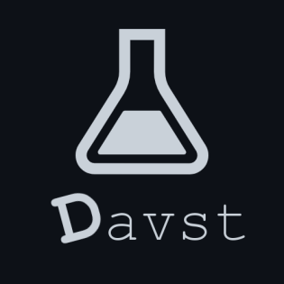

# Davst

<div style="text-align: center">
    
    <p>卒業研究の実験結果が閲覧できるアプリ</p>
</div>

## 環境
- deno 1.21.0
- Puddle v1.1.2-beta
- typescript 4.6.2

## 製作時間
3時間くらい(研究データを整える時間がほとんど)

## 構成(tree)
```sh
.
├── config
│   ├── auth.env
│   └── auth.example.env
├── deps.ts
├── funcs
│   └── TemplateTag.ts
├── log
│   └── request.log
├── README.md
├── server.ts
└── views
    ├── assets
    │   ├── images
    │   │   ├── davst_logo.png
    │   │   └── favicon.ico
    │   ├── scripts
    │   └── styles
    │       ├── basic.css
    │       ├── github-markdown-dark.css
    │       ├── graph.css
    │       ├── header.css
    │       └── hljs.css
    ├── home
    │   └── index.html
    ├── result
    │   └── [articles].html
    └── templates
        ├── footer.html
        ├── head.html
        └── header.html
```